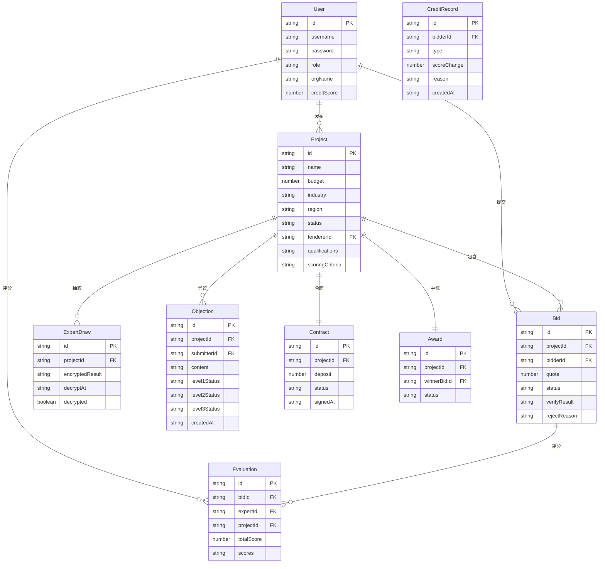

## 1. 架构设计

```mermaid
flowchart TB
    subgraph "前端层"
        "React 18 + TypeScript"
        "React Router v6"
        "Tailwind CSS"
        "Zustand 状态管理"
        "ECharts 数据可视化"
    end
    subgraph "后端层"
        "Express.js + TypeScript"
        "RESTful API"
        "JWT 认证中间件"
        "角色权限中间件"
    end
    subgraph "数据层"
        "SQLite 数据库"
        "Mock 数据填充"
    end
    "前端层" --> "后端层"
    "后端层" --> "数据层"
```

## 2. 技术说明

- 前端：React@18 + TypeScript + Tailwind CSS@3 + Vite
- 状态管理：Zustand
- 数据可视化：ECharts
- 图标库：lucide-react
- 初始化工具：vite-init
- 后端：Express@4 + TypeScript (ESM)
- 数据库：SQLite（better-sqlite3），Mock数据填充
- 认证：JWT Token + 角色权限

## 3. 路由定义

| 路由 | 用途 | 权限 |
|------|------|------|
| / | 首页大屏 | 所有角色 |
| /login | 登录页 | 公开 |
| /projects | 招标项目列表 | 所有角色 |
| /projects/create | 发布招标项目 | 招标人、管理员 |
| /projects/:id | 项目详情 | 所有角色 |
| /bids | 投标列表 | 投标人 |
| /bids/submit/:projectId | 提交投标 | 投标人 |
| /bids/verify/:id | 投标校验结果 | 投标人、管理员 |
| /experts | 专家抽取 | 管理员 |
| /bid-opening/:projectId | 开标大厅 | 所有角色 |
| /evaluation/:projectId | 评标大厅 | 专家、管理员 |
| /awards/:projectId | 中标公示 | 所有角色 |
| /objections/:projectId | 异议管理 | 所有角色 |
| /contracts/:projectId | 合同管理 | 招标人、投标人 |
| /credit | 信用评价 | 投标人、管理员、监管部门 |
| /analytics | 数据分析 | 管理员、监管部门 |
| /admin | 系统管理 | 管理员、监管部门 |

## 4. API定义

### 4.1 认证相关

```typescript
POST /api/auth/login
  Request: { username: string; password: string; role: UserRole }
  Response: { token: string; user: User }

POST /api/auth/register
  Request: { username: string; password: string; role: UserRole; orgName: string }
  Response: { token: string; user: User }
```

### 4.2 项目相关

```typescript
GET /api/projects
  Query: { industry?: string; region?: string; status?: string; page?: number }
  Response: { list: Project[]; total: number }

POST /api/projects
  Request: { name: string; budget: number; industry: string; region: string; qualifications: string[]; scoringCriteria: ScoringCriteria[]; description: string }
  Response: Project

GET /api/projects/:id
  Response: Project

GET /api/projects/:id/templates
  Response: Template[]

POST /api/projects/:id/publish
  Response: { success: boolean; announcementId: string }
```

### 4.3 投标相关

```typescript
GET /api/bids
  Query: { projectId?: string; status?: string }
  Response: Bid[]

POST /api/bids
  Request: { projectId: string; quote: number; documents: FileInfo[]; keyParams: Record<string, string> }
  Response: Bid

POST /api/bids/:id/verify
  Response: VerifyResult

POST /api/bids/:id/reject
  Request: { reason: string }
  Response: { success: boolean }
```

### 4.4 专家抽取

```typescript
POST /api/experts/draw
  Request: { projectId: string; specialties: string[]; count: number; excludeIds: string[] }
  Response: { drawId: string; encryptedResult: string; decryptAt: string }

GET /api/experts/draw/:drawId
  Response: { decrypted: boolean; experts?: Expert[] }
```

### 4.5 开标评标

```typescript
POST /api/bid-opening/:projectId/decrypt
  Response: BidOpeningResult[]

POST /api/evaluation/:projectId/score
  Request: { expertId: string; bidId: string; scores: { criteriaId: string; score: number }[] }
  Response: { success: boolean }

GET /api/evaluation/:projectId/result
  Response: EvaluationResult
```

### 4.6 中标与异议

```typescript
POST /api/awards/:projectId/publish
  Response: Award

POST /api/objections
  Request: { projectId: string; content: string; evidence: FileInfo[] }
  Response: Objection

POST /api/objections/:id/approve
  Request: { level: 'tenderer' | 'center' | 'supervisor'; approved: boolean; comment: string }
  Response: Objection
```

### 4.7 合同相关

```typescript
POST /api/contracts
  Request: { projectId: string; content: string; deposit: number }
  Response: Contract

POST /api/contracts/:id/sign
  Request: { signature: string }
  Response: Contract

POST /api/contracts/:id/amend
  Request: { reason: string; documents: FileInfo[] }
  Response: Contract
```

### 4.8 信用评价

```typescript
GET /api/credit/:bidderId
  Response: CreditInfo

GET /api/credit/alerts
  Response: CreditAlert[]

GET /api/credit/distribution
  Query: { byIndustry?: boolean; byRegion?: boolean }
  Response: CreditDistribution
```

### 4.9 数据分析

```typescript
GET /api/analytics/overview
  Response: DashboardData

GET /api/analytics/report
  Query: { industry?: string; region?: string; startDate?: string; endDate?: string; type: 'monthly' | 'credit' }
  Response: ReportData

GET /api/analytics/export
  Query: { format: 'xlsx' | 'pdf'; type: 'monthly' | 'credit' }
  Response: Blob
```

## 5. 服务器架构

```mermaid
flowchart LR
    "Controller" --> "Service"
    "Service" --> "Repository"
    "Repository" --> "SQLite"
```

## 6. 数据模型

### 6.1 数据模型定义



### 6.2 数据定义语言

```sql
CREATE TABLE users (
  id TEXT PRIMARY KEY,
  username TEXT NOT NULL UNIQUE,
  password TEXT NOT NULL,
  role TEXT NOT NULL CHECK(role IN ('tenderer','bidder','expert','admin','supervisor')),
  org_name TEXT NOT NULL,
  credit_score REAL DEFAULT 100,
  created_at TEXT DEFAULT (datetime('now'))
);

CREATE TABLE projects (
  id TEXT PRIMARY KEY,
  name TEXT NOT NULL,
  budget REAL NOT NULL,
  industry TEXT NOT NULL,
  region TEXT NOT NULL,
  status TEXT DEFAULT 'draft' CHECK(status IN ('draft','published','bidding','evaluating','awarded','contracted','completed','failed')),
  tenderer_id TEXT NOT NULL REFERENCES users(id),
  qualifications TEXT DEFAULT '[]',
  scoring_criteria TEXT DEFAULT '[]',
  description TEXT,
  template_id TEXT,
  announcement_id TEXT,
  deadline TEXT,
  created_at TEXT DEFAULT (datetime('now'))
);

CREATE TABLE bids (
  id TEXT PRIMARY KEY,
  project_id TEXT NOT NULL REFERENCES projects(id),
  bidder_id TEXT NOT NULL REFERENCES users(id),
  quote REAL NOT NULL,
  documents TEXT DEFAULT '[]',
  key_params TEXT DEFAULT '{}',
  status TEXT DEFAULT 'pending' CHECK(status IN ('pending','verified','rejected','opened','scored')),
  verify_result TEXT,
  reject_reason TEXT,
  encrypted_content TEXT,
  created_at TEXT DEFAULT (datetime('now'))
);

CREATE TABLE expert_draws (
  id TEXT PRIMARY KEY,
  project_id TEXT NOT NULL REFERENCES projects(id),
  specialties TEXT DEFAULT '[]',
  exclude_ids TEXT DEFAULT '[]',
  encrypted_result TEXT,
  decrypt_at TEXT,
  decrypted INTEGER DEFAULT 0,
  created_at TEXT DEFAULT (datetime('now'))
);

CREATE TABLE evaluations (
  id TEXT PRIMARY KEY,
  bid_id TEXT NOT NULL REFERENCES bids(id),
  expert_id TEXT NOT NULL REFERENCES users(id),
  project_id TEXT NOT NULL REFERENCES projects(id),
  scores TEXT DEFAULT '[]',
  total_score REAL DEFAULT 0,
  comment TEXT,
  created_at TEXT DEFAULT (datetime('now'))
);

CREATE TABLE awards (
  id TEXT PRIMARY KEY,
  project_id TEXT NOT NULL REFERENCES projects(id),
  winner_bid_id TEXT NOT NULL REFERENCES bids(id),
  status TEXT DEFAULT 'published' CHECK(status IN ('published','objected','confirmed','revoked')),
  published_at TEXT DEFAULT (datetime('now'))
);

CREATE TABLE objections (
  id TEXT PRIMARY KEY,
  project_id TEXT NOT NULL REFERENCES projects(id),
  submitter_id TEXT NOT NULL REFERENCES users(id),
  content TEXT NOT NULL,
  evidence TEXT DEFAULT '[]',
  level1_status TEXT DEFAULT 'pending' CHECK(level1_status IN ('pending','approved','rejected')),
  level1_comment TEXT,
  level2_status TEXT DEFAULT 'pending' CHECK(level2_status IN ('pending','approved','rejected')),
  level2_comment TEXT,
  level3_status TEXT DEFAULT 'pending' CHECK(level3_status IN ('pending','approved','rejected')),
  level3_comment TEXT,
  created_at TEXT DEFAULT (datetime('now')),
  updated_at TEXT DEFAULT (datetime('now'))
);

CREATE TABLE contracts (
  id TEXT PRIMARY KEY,
  project_id TEXT NOT NULL REFERENCES projects(id),
  deposit REAL DEFAULT 0,
  status TEXT DEFAULT 'draft' CHECK(status IN ('draft','signed','amending','completed')),
  content TEXT,
  signed_at TEXT,
  amendments TEXT DEFAULT '[]',
  created_at TEXT DEFAULT (datetime('now'))
);

CREATE TABLE credit_records (
  id TEXT PRIMARY KEY,
  bidder_id TEXT NOT NULL REFERENCES users(id),
  type TEXT NOT NULL CHECK(type IN ('bid','win','fulfill','breach','objection','penalty')),
  score_change REAL NOT NULL,
  reason TEXT NOT NULL,
  project_id TEXT REFERENCES projects(id),
  created_at TEXT DEFAULT (datetime('now'))
);

CREATE INDEX idx_projects_status ON projects(status);
CREATE INDEX idx_projects_tenderer ON projects(tenderer_id);
CREATE INDEX idx_bids_project ON bids(project_id);
CREATE INDEX idx_bids_bidder ON bids(bidder_id);
CREATE INDEX idx_evaluations_project ON evaluations(project_id);
CREATE INDEX idx_credit_records_bidder ON credit_records(bidder_id);
```
